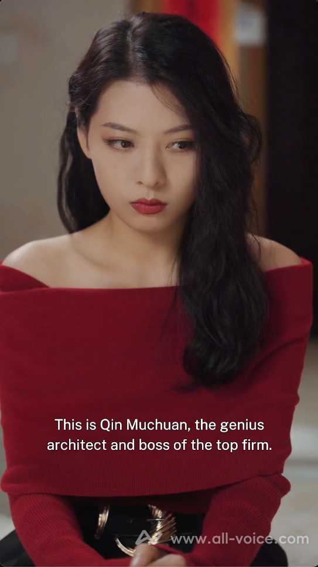
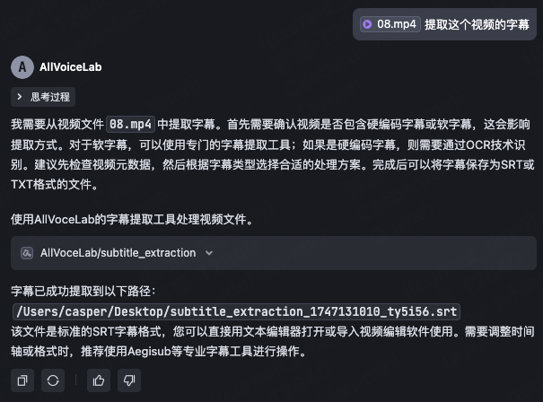

<div align="center" style="line-height: 1;">
  <a href="https://allvoicelab.cn" target="_blank" style="margin: 2px; color: var(--fgColor-default);">
  
  </a>
  <a href="https://www.allvoicelab.cn/docs/introduction" style="margin: 2px;">
    
  </a>
   <a href="https://github.com/allvoicelab/AllVoiceLab-MCP/blob/main/LICENSE" style="margin: 2px;">
    
  </a>
</div>


<p align="center">
AllVoiceLab官方模型上下文协议(MCP)服务器，支持与强大的文本转语音和视频翻译API交互。允许MCP客户端如Claude Desktop、Cursor、Windsurf、OpenAI Agents等生成语音、翻译视频、智能变声等功能。服务短剧出海本地化、影视解说工业化、有声书智能生产等场景。
</p>

## 为什么选择AllVoiceLab MCP Server？

- 多重技术引擎,解锁声音无限可能：只需简单文本输入,即可调用视频生成、语音生成和声音克隆等多项能力
- TTS语音合成：支持30+语言的自然语音生成,超高拟真度
- 智能变声：实时音色转换,适配游戏/直播/隐私保护场景
- 人声分离：极速分离人声与背景音,精度行业领先
- 多语种配音：支持短剧/影视一键翻译配音,保留情感韵律
- 语音转文本：视频智能生成多语字幕,准确率超98%
- 字幕擦除：无痕去除字幕,支持复杂背景修复

## 文档

[英文文档](../README.md)


## 快速开始

1. 从[AllVoiceLab](https://www.allvoicelab.com/)获取您的API密钥。
2. 安装`uv`（Python包管理器），使用`curl -LsSf https://astral.sh/uv/install.sh | sh`进行安装
3. **重要**：不同地区的API的服务器地址需求匹配对应地区的密钥，否则会有工具不可用的错误

|地区| 全球  | 中国大陆  |
|:--|:-----|:-----|
|ALLVOICELAB_API_KEY| 从[AllVoiceLab](https://www.allvoicelab.com/workbench/api-keys)获取 | 从[趣玩千音](https://www.allvoicelab.cn/workbench/api-keys)获取 |
|ALLVOICELAB_API_DOMAIN| https://api.allvoicelab.com | https://api.allvoicelab.cn |

### Claude Desktop

前往Claude > 设置 > 开发者 > 编辑配置 > claude_desktop_config.json，添加以下内容：
```json
{
  "mcpServers": {
    "AllVoceLab": {
      "command": "uvx",
      "args": ["allvoicelab-mcp"],
      "env": {
        "ALLVOICELAB_API_KEY": "<在此插入您的API密钥>",
        "ALLVOICELAB_API_DOMAIN": "<在此插入API域名>",
        "ALLVOICELAB_BASE_PATH":"可选，默认为用户主目录。用于存储输出文件。"
      }
    }
  }
}
```

如果您使用Windows，您需要在Claude Desktop中启用"开发者模式"才能使用MCP服务器。点击左上角汉堡菜单中的"帮助"，然后选择"启用开发者模式"。

### Cursor
前往Cursor -> 首选项 -> Cursor设置 -> MCP -> 添加新的全局MCP服务器，添加上述配置。

您的MCP客户端现在可以与AllVoiceLab交互

## 可用方法

| 方法 | 简要描述 |
| --- | --- |
| text_to_speech | 将文本转换为语音 |
| speech_to_speech | 将音频转换为另一个声音，同时保留语音内容 |
| isolate_human_voice | 通过去除背景噪音和非语音声音来提取干净的人声 |
| remove_subtitle | 使用OCR技术从视频中移除硬编码字幕 |
| video_translation_dubbing | 将视频语音翻译并配音成不同语言 |
| text_translation | 将文本文件翻译成另一种语言 |
| subtitle_extraction | 使用OCR技术从视频中提取字幕 |

## 使用示例

⚠️ 警告：使用这些工具需要AllVoiceLab积分。

### 1. 生成语音

尝试询问：将"All Voice Lab是全球领先的AI语音创作平台，专注提供一站式智能语音解决方案。集成文本转语音、视频翻译、声音克隆等多元能力，支持多语种多音色互换，帮助全球用户高效创作，告别语言障碍。"转换成语音


### 2. 转换语音

接着上面的例子，选择上面生成的音频文件后，尝试询问：转成男声。


### 3. 去除背景噪声

选择一个声音比较丰富的，有BGM和人声的音频文件后，尝试询问：去除背景噪声。


### 4. 视频翻译

选择一个视频文件后（非英文的），尝试询问：把这个视频翻译成英文。


原视频：


翻译后：




### 5. 擦除字幕

选择一个带有字幕的音频文件后，尝试询问：擦除这个视频的字幕。


原视频：


去除字幕后：


### 6. 文本翻译

选择一个长文本，这里使用《愚公移山》作为示例，尝试询问：翻译这个长文本。
在不指定语言的情况下，默认会翻译为英语。


### 7. 字幕提取

选择一个带有字幕的视频，尝试询问：提取这个视频的字幕。



任务完成后，会有一个srt文件，如下图所示：


## 故障排除

日志可以在以下位置找到：

- Windows: C:\Users\<用户名>\.mcp\allvoicelab_mcp.log
- macOS: ~/.mcp/allvoicelab_mcp.log

请通过电子邮件（tech@allvoicelab.com）联系我们并附上日志文件